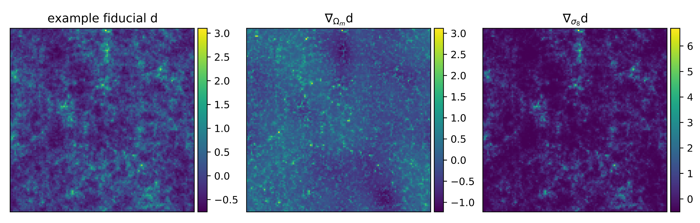
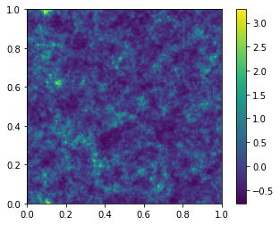

# powerbox-jax
"`powerbox` + `Jax` ... like PB&J, an ideal combo"

Jax implementation of [`powerbox`](https://github.com/steven-murray/powerbox) for autodifferentiability.
 `powerbox-jax` is functionally equivalent to `powerbox`, but is now fully differentiable and XLA-compatible !
 



## installation

For installation on the command line or Colab, call

`pip install git+https://github.com/tlmakinen/powerbox-jax.git`


## example: generate a differentiable mock dark matter field
In computational cosmology it is of interest to take gradients of cosmological *fields* with respect to underlying global parameters. Doing so lets us efficiently calculate information content and train neural networks via gradient descent (see https://arxiv.org/abs/2107.07405).

For this example we'll need to install the `imnn` and `jax-cosmo` packages:

`pip install imnn`

and

`pip install jax-cosmo`

Now onto the code. First import the necessary packages:
```python
import jax.numpy as np
from jax import grad, jit, vmap
from jax import random
import jax

# for getting gradients
from imnn.utils import value_and_jacrev, value_and_jacfwd

# for the power spectrum
import jax_cosmo as jc

# powerbox-jax import
import powerbox_jax as pbj
from powerbox_jax.dft import _set_left_edge, fftfreq

# for get_power function
import powerbox as pbox
```
Next, let's define a (differentiable !) cosmological power spectrum using [`jax-cosmo`](https://github.com/DifferentiableUniverseInitiative/jax_cosmo). We're going to vary two parameters for our universe,  and .

```python
# define cosmology
cosmo_params = jc.Planck15(Omega_c=0.4, sigma8=0.6)
θ_fid = np.array(
    [cosmo_params.Omega_c,
     cosmo_params.sigma8],
    dtype=np.float32)

# define power spectrum
def P(k, A=0.40, B=0.60):
    cosmo_params = jc.Planck15(Omega_c=A, sigma8=B)
    return jc.power.linear_matter_power(cosmo_params, k)

```
Next we'll choose a Jax `PRNGKey` and create a `LogNormalPowerBox` object:

```python
rng = jax.random.PRNGKey(32)

N = 128.
L = 250. # Mpc

lnpb = pbj.LogNormalPowerBox(
    N=N,                                   # Number of grid-points in the box
    dim=2,                                 # 2D box
    pk = lambda k: P(k, A=0.3, B=0.8) / L, # The power-spectrum
    boxlength = L,                         # Size of the box (sets the units of k in pk)
    key = rng,                             # specify Jax PRNGKey
    vol_normalised_power=True,             # normalise power by volume
    supplied_freqs=None
)
plt.imshow(lnpb.delta_x()[:, :],extent=(0,1,0,1))
plt.colorbar()
plt.show()
```


Next, we can check to see if the simulator is indeed incorporating the power spectrum that we specified (using the original `powerbox` `get_power()` method):

```python
p_k_lnfield, bins_lnfield = pbox.get_power(lnpb.delta_x(), lnpb.boxlength)
plt.plot(bins_lnfield, p_k_lnfield, label='simulated power')
plt.plot(bins_lnfield, P(bins_lnfield, 0.3, 0.8)/250., label='input power')
plt.legend()
plt.yscale('log')
plt.xscale('log')
```


Nex, we can code a little wrapper for our gradient calculator:
```python
def simulator(key, θ):
    A,B = θ
    
    lnpb = pbj.LogNormalPowerBox(
        N=128,                                # Number of grid-points in the box
        dim=2,                                # 2D box
        pk = lambda k: P(k, A=A, B=B) / 250., # The power-spectrum
        boxlength = 250.0,                    # Size of the box (sets the units of k in pk)
        key = key                             # Use the same seed as our powerbox
    )
    return lnpb.delta_x()
```

and finally compute the gradients with respect to our two cosmological parameters for this fiducial universe !

```python
# new random key
key,rng = jax.random.split(rng)

def simulator_gradient(rng, θ):
    return value_and_jacrev(simulator, argnums=1, allow_int=True, holomorphic=True)(rng, θ)

simulation, simulation_gradient = value_and_jacfwd(simulator, argnums=1)(rng, θ_fid)
cmap = 'viridis'

# some plotting stuff
from mpl_toolkits.axes_grid1 import make_axes_locatable

fig,ax = plt.subplots(nrows=1, ncols=3, figsize=(12,15))

im1 = ax[0].imshow(np.squeeze(simulation), 
                   extent=(0,1,0,1), cmap=cmap)
ax[0].title.set_text(r'example fiducial $\rm d$')
divider = make_axes_locatable(ax[0])
cax = divider.append_axes('right', size='5%', pad=0.05)
fig.colorbar(im1, cax=cax, orientation='vertical')

im1 = ax[1].imshow(np.squeeze(simulation_gradient).T[0].T, 
                   extent=(0,1,0,1), cmap=cmap)
ax[1].title.set_text(r'$\nabla_{\Omega_m} \rm d$')
divider = make_axes_locatable(ax[1])
cax = divider.append_axes('right', size='5%', pad=0.05)
fig.colorbar(im1, cax=cax, orientation='vertical')

im1 = ax[2].imshow(np.squeeze(simulation_gradient).T[1].T, 
                   extent=(0,1,0,1), cmap=cmap)
ax[2].title.set_text(r'$\nabla_{\sigma_8} \rm d$')
divider = make_axes_locatable(ax[2])
cax = divider.append_axes('right', size='5%', pad=0.05)
fig.colorbar(im1, cax=cax, orientation='vertical')

for a in ax:
    a.set_xticks([])
    a.set_yticks([])
    
plt.show()

```

